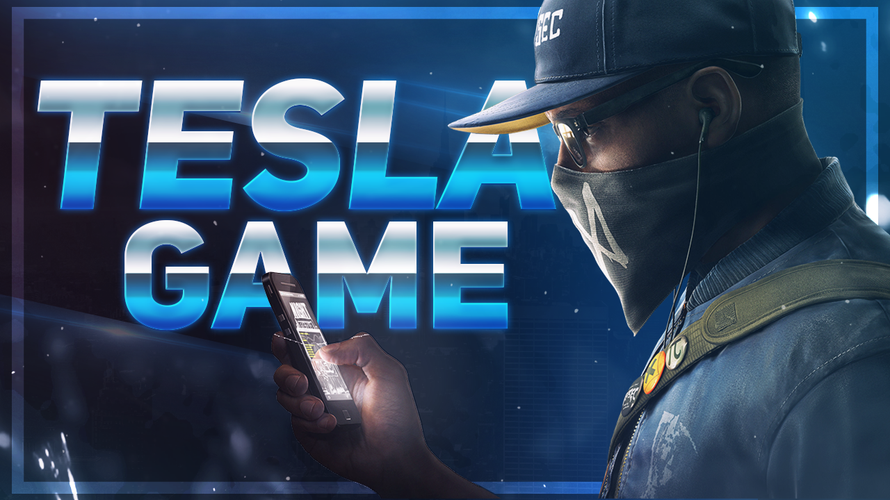

<!-- PROJE LOGO -->
 

  

  <h2 align="center"><a href="https://t.me/muhabbetofkings">🔍 bozkurtgamebot Proje Sahibi: bozkurt20 </a></h2>

  

    <b>Merhaba, bozkurt20 Projesi ile Karşınızdayız. Bot 1 günden  Fazladır Telegram da Aktif Olarak Kullanıcılara Oyun Konusun da kolaylık Sağlıyor
Şuan Kullanılan <a href="https://t.me/bozkurtgamebot" >@TeslaGameBot</a>'un  
Eski Alt Versiyon Projesi GitHub'da Kullanıcılara Açık Sunuldu.</b>
  
<strong><a href="https://telegra.ph/TeslaGame-Türkçe-Oyun-Rehberi-05-29">Dökümanı Okuyun</a></strong>
    ·
    <strong><a href="https://t.me/bozkurt20">Hata Bildir</a></strong>
   

<!-- LICENSE -->
## License

GNU Affero Genel Kamu Lisansı altında paylaşılmaktadır.  
Daha fazla bilgi için `LICENSE` bölümüne bakın. Copyright (C) 2022 
Tüm hakları saklıdır!

